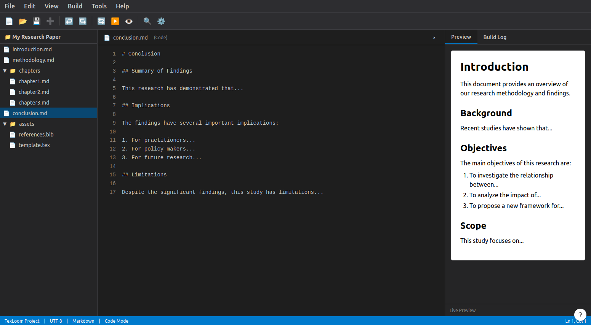
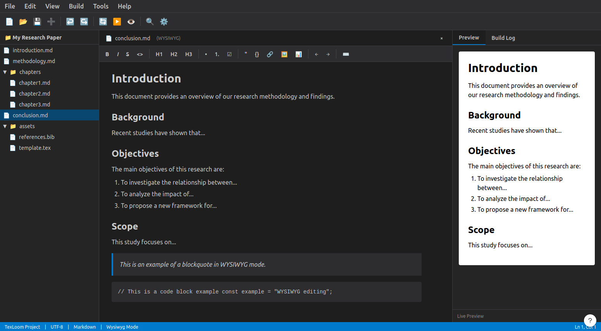

# TexLoom — Roadmap

## Core differentiators to implement

- [ ] Multi-file project support (book, thesis, report)
- [ ] Real-time PDF preview
- [ ] Integrated LaTeX templates (easy to configure)
- [ ] Simple bibliography management (BibTeX)
- [ ] Clean export for scientific articles and reports
- [ ] Fast, stable compilation pipeline
- [ ] Multi-language support (English and French, to begin with)

## Architecture

- [x] GUI: Qt (C++)
- [ ] Editor: text component with Markdown syntax highlighting
  - Code mode (raw Markdown)
  - WYSIWYG mode (visual editing)
- [x] Conversion: Pandoc => LaTeX => PDF pipeline (ConversionEngine implemented)
- [ ] Preview: embedded PDF viewer
- [ ] Project manager: `.md` file list/tree

## GUI

See [images/mockups/](images/mockups/) for editor mode designs

### Code Mode (Raw Markdown Editor)

### WYSIWYG Mode (Visual Markdown Editor)

**Documentation**: See [docs/menus-and-actions.md](docs/menus-and-actions.md) for complete menu/action specifications

## Open questions

- [x] Pandoc dependency vs. custom Markdown parser? → **Pandoc 3.1+**
- [x] Which LaTeX engine? (pdflatex / xelatex / lualatex) → **XeLaTeX** (Unicode/multilingual)
- [x] Bundled templates: which formats to prioritize? → **article, report, thesis** (Pandoc LaTeX format)
- [x] Cross-platform scope: Linux only or Windows/macOS too? → **Linux-first, cross-platform ready**
